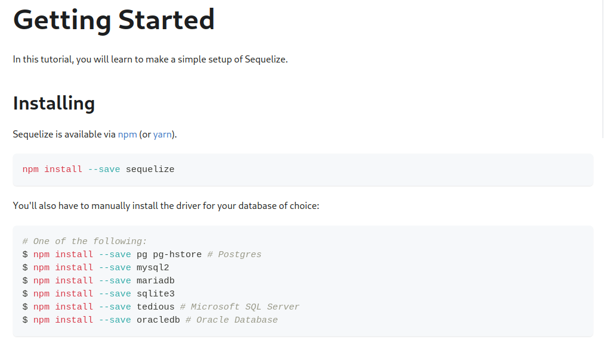
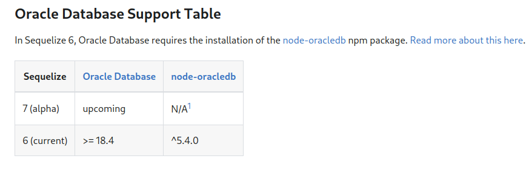

# dependencies-showcase
* backend - действующий бэкенд
* frontend - действующий фронтенд
* backend-oracle - создан ДЛЯ ПРИМЕРА, не используется. Бэкенд в случае использования oracledb

Проверка на использование oracle.

Для выполнения команд должен быть установлен node, npm и git bash(для `ls`). `ls` можно заменить обычным просмотром 
в проводнике.

Заходим в папку, ставим зависимости, смотрим папки в node_modules на предмет
oracle

## backend
```shell
cd backend
npm i
ls -1 node_modules
```
oracle отсутствует:
```
// результат ls
abstract-logging
accepts
acorn
acorn-jsx
acorn-node
acorn-walk
aggregate-error
ajv
ajv-formats
ajv-keywords
@ampproject
ansi-escapes
ansi-regex
ansi-styles
anymatch
arg
argparse
array-buffer-byte-length
arraybuffer.prototype.slice
array-flatten
array-from
array-includes
array.prototype.findlastindex
array.prototype.flat
array.prototype.flatmap
array-union
asn1
asn1-ber
asn1.js
assert
assert-plus
async
at-least-node
available-typed-arrays
b4a
@babel
babel-jest
babel-plugin-istanbul
babel-plugin-jest-hoist
babel-preset-current-node-syntax
babel-preset-jest
backoff
balanced-match
base64id
base64-js
@bcoe
bcryptjs
bcrypt-pbkdf
big.js
bindings
bit-twiddle
bl
bn.js
body-parser
brace-expansion
braces
brfs
brorand
brotli
browserify
browserify-aes
browserify-cipher
browserify-des
browserify-rsa
browserify-sign
browserify-zlib
browser-pack
browser-resolve
browserslist
bser
buffer
buffer-equal
buffer-from
buffer-xor
buildcheck
builtin-status-codes
busboy
bytes
cached-path-relative
call-bind
call-bind-apply-helpers
call-bound
callsites
camelcase
caniuse-lite
cephes
chalk
char-regex
check-disk-space
check-more-types
chownr
chrome-trace-event
ci-info
cipher-base
cjs-module-lexer
clean-stack
@clinic
clipboard-copy
cliui
clone
clone-deep
co
collect-v8-coverage
color-convert
colorette
color-name
combine-source-map
commander
concat-map
concat-stream
concolor
console-browserify
constants-browserify
content-disposition
content-type
convert-source-map
cookie
cookie-parser
cookie-signature
core-util-is
cors
cpu-features
create-ecdh
create-hash
create-hmac
create-jest
create-require
cross-spawn
crypto-browserify
crypto-js
crypto-random-string
@cspotcode
cwise-compiler
d
d3-array
d3-axis
d3-color
d3-format
d3-interpolate
d3-path
d3-scale
d3-selection
d3-shape
d3-time
d3-time-format
@danieldietrich
dash-ast
data-view-buffer
data-view-byte-length
data-view-byte-offset
debug
decamelize
decompress-response
dedent
deep-equal
deep-extend
deep-is
deepmerge
defined
define-data-property
define-properties
del
depd
deps-sort
des.js
destroy
detective
detect-libc
detect-newline
dfa
diff
diffie-hellman
diff-sequences
dir-glob
@discoveryjs
distributions
dnssd
doctrine
domain-browser
dotenv
dotenv-expand
dottie
dunder-proto
dup
duplexer2
duplexify
ee-first
electron-to-chromium
elliptic
emittery
emoji-regex
emojis-list
encodeurl
end-of-stream
endpoint
engine.io
engine.io-parser
enhanced-resolve
envinfo
error-ex
es5-ext
es6-iterator
es6-map
es6-set
es6-symbol
es-abstract
escalade
escape-html
escape-string-regexp
escodegen
es-define-property
es-errors
es-get-iterator
@eslint
eslint
@eslint-community
eslint-config-prettier
eslint-import-resolver-node
eslint-module-utils
eslint-plugin-import
eslint-plugin-prettier
eslint-scope
eslint-visitor-keys
es-module-lexer
esniff
es-object-atoms
espree
esprima
esquery
esrecurse
es-set-tostringtag
es-shim-unscopables
es-to-primitive
estraverse
estree-is-function
esutils
etag
event-emitter
events
evp_bytestokey
execa
exit
expand-template
expect
express
express-fileupload
express-session
ext
extsprintf
fast-deep-equal
fast-diff
fastest-levenshtein
fast-glob
fast-json-stable-stringify
fast-levenshtein
fastq
fast-safe-stringify
fast-uri
fb-watchman
file-entry-cache
file-type
file-uri-to-path
fill-range
finalhandler
find-up
find-yarn-workspace-root
flat
flat-cache
flatted
fontkit
for-each
forwarded
fresh
from2
from2-string
fs-constants
fs-extra
fs.realpath
function-bind
function.prototype.name
functions-have-names
generate-function
generate-object-property
gensync
get-assigned-identifiers
get-caller-file
get-intrinsic
get-package-type
get-stream
get-symbol-description
ghostscript-node
github-from-package
glob
globals
globalthis
globby
glob-parent
glob-to-regexp
gopd
graceful-fs
graphemer
has
has-bigints
has-flag
hash-base
hash.js
hasown
has-property-descriptors
has-proto
has-symbols
has-tostringtag
hidden-markov-model-tf
hmac-drbg
htmlescape
html-escaper
http-errors
https-browserify
human-signals
@humanwhocodes
iconv-lite
ieee754
ignore
import-fresh
import-lazy
import-local
imurmurhash
indent-string
inflection
inflight
inherits
ini
inline-source-map
insert-module-globals
internal-slot
internmap
interpret
iota-array
ipaddr.js
is-any-array
is-arguments
isarray
is-array-buffer
is-arrayish
is-async-function
is-bigint
is-boolean-object
is-buffer
is-callable
is-ci
is-core-module
is-data-view
is-date-object
is-docker
isexe
is-extglob
is-finalizationregistry
is-fullwidth-code-point
is-generator-fn
is-generator-function
is-glob
is-map
is-negative-zero
is-number
is-number-object
isobject
is-path-cwd
is-path-inside
is-plain-object
is-property
is-regex
is-set
is-shared-array-buffer
is-stream
is-string
is-symbol
@istanbuljs
istanbul-lib-coverage
istanbul-lib-instrument
istanbul-lib-report
istanbul-lib-source-maps
istanbul-reports
is-typed-array
is-weakmap
is-weakref
is-weakset
is-wsl
@jest
jest
jest-changed-files
jest-circus
jest-cli
jest-config
jest-diff
jest-docblock
jest-each
jest-environment-node
jest-get-type
jest-haste-map
jest-leak-detector
jest-matcher-utils
jest-message-util
jest-mock
jest-pnp-resolver
jest-regex-util
jest-resolve
jest-resolve-dependencies
jest-runner
jest-runtime
jest-snapshot
jest-util
jest-validate
jest-watcher
jest-worker
jju
@jridgewell
jsesc
json5
json-buffer
jsonfile
jsonparse
json-parse-even-better-errors
json-schema-traverse
json-stable-stringify-without-jsonify
JSONStream
json-stringify-safe
js-tokens
js-yaml
kerberos
keyv
kind-of
klaw-sync
kleur
labeled-stream-splicer
lazy-ass
ldap-authentication
ldap-filter
ldapjs
leven
levn
linebreak
lines-and-columns
loader-runner
loader-utils
locate-path
lodash
lodash.debounce
lodash.memoize
lodash.merge
long
loose-envify
lru-cache
magic-string
make-dir
make-error
makeerror
math-intrinsics
md5.js
media-typer
merge2
merge-descriptors
merge-source-map
merge-stream
metalog
metautil
methods
micromatch
miller-rabin
mime
mime-db
mime-types
mimic-fn
mimic-response
minify-stream
minimalistic-assert
minimalistic-crypto-utils
minimatch
minimist
mkdirp
mkdirp-classic
ml-array-max
ml-array-min
ml-array-rescale
ml-distance-euclidean
ml-kmeans
ml-matrix
ml-nearest-vector
ml-random
ml-xsadd
mocked-env
module-deps
moment
moment-timezone
ms
multistream
nan
nanoid
napi-build-utils
natural-compare
ndarray
ndarray-blas-level1
ndarray-cholesky-factorization
ndarray-crout-decomposition
ndarray-determinant
ndarray-diagonal
ndarray-inv
ndarray-ops
ndarray-scratch
negotiator
neo-async
net-snmp
next-tick
nice-try
node-abi
node-addon-api
node-arp
node-fetch
node-int64
@nodelib
node-loader
nodemailer
node-releases
node-rsa
node-ssh
normalize-path
npm-run-path
object-assign
object.assign
object.fromentries
object.groupby
object-inspect
object-is
object-keys
object.values
obuf
once
onetime
on-finished
on-headers
on-net-listen
open
optionator
os-browserify
os-tmpdir
pako
parent-module
parents
parse-asn1
parse-json
parseurl
patch-package
path-browserify
path-exists
path-is-absolute
path-key
path-parse
path-platform
path-to-regexp
path-type
pbkdf2
pdfkit
@pdf-lib
pdf-lib
peek-readable
p-finally
pg
pg-cloudflare
pg-connection-string
pg-int8
pg-numeric
pgpass
pg-pool
pg-protocol
pg-types
picocolors
picomatch
pify
pirates
pkg-dir
p-limit
p-locate
p-map
png-js
pony-cause
possible-typed-array-names
postcss
postcss-import
postcss-value-parser
postgres-array
postgres-bytea
postgres-date
postgres-interval
postgres-range
postinstall
prebuild-install
precond
prelude-ls
prettier
prettier-linter-helpers
pretty-format
@prisma
prisma
process
process-nextick-args
prompts
protocol-buffers
protocol-buffers-encodings
protocol-buffers-schema
proxy-addr
p-try
public-encrypt
pump
pumpify
punycode
pure-rand
qr-image
qs
querystring-es3
queue-microtask
quote-stream
ramda
random-bytes
randombytes
randomfill
range-parser
raw-body
rc
react-is
readable-stream
readable-web-to-node-stream
read-cache
read-chunk
read-only-stream
rechoir
reflect.getprototypeof
regexp.prototype.flags
require-directory
require-from-string
require-main-filename
resolve
resolve-cwd
resolve.exports
resolve-from
resolve-pkg
restructure
retry-as-promised
reusify
rimraf
ripemd160
@rtsao
run-parallel
@rushstack
rxjs
safe-array-concat
safe-buffer
safer-buffer
safe-regex-test
sb-promise-queue
sb-scandir
schema-utils
scope-analyzer
@sealsystems
seedrandom
semver
send
sequelize
sequelize-pool
serialize-javascript
serve-static
set-blocking
set-function-length
set-function-name
setprototypeof
sha.js
shallow-clone
shallow-copy
shasum-object
shebang-command
shebang-regex
shell-escape
shell-quote
showdown
side-channel
side-channel-list
side-channel-map
side-channel-weakmap
signal-exit
signed-varint
simple-concat
simple-get
@sinclair
@sinonjs
sisteransi
slash
smart-buffer
@socket.io
socket.io
socket.io-adapter
socket.io-parser
software-license-key
source-map
sourcemap-codec
source-map-js
source-map-support
split2
sprintf-js
ssh2
stack-utils
static-eval
static-module
statuses
stop-iteration-iterator
stream-browserify
stream-combiner2
stream-http
streaming-json-stringify
streamsearch
stream-shift
stream-splicer
stream-template
string-argv
string_decoder
string-length
string.prototype.trim
string.prototype.trimend
string.prototype.trimstart
string-width
strip-ansi
strip-bom
strip-final-newline
strip-json-comments
strtok3
subarg
summary
supports-color
supports-preserve-symlinks-flag
@swc
syntax-error
tapable
tar-fs
tar-stream
temp-dir
tempy
@tensorflow
terser
terser-webpack-plugin
test-exclude
text-table
through
through2
timers-browserify
tiny-inflate
tmp
tmpl
toidentifier
@tokenizer
token-types
toposort-class
to-regex-range
tr46
@tsconfig
tsconfig-paths
tslib
ts-node
tsutils
ttest
tty-browserify
tunnel-agent
turbo-json-parse
tweetnacl
type
type-check
typedarray
typed-array-buffer
typed-array-byte-length
typed-array-byte-offset
typed-array-length
typedarray-pool
type-detect
type-fest
type-is
@types
typescript
@typescript-eslint
uid-safe
umd
umzug
unbox-primitive
undeclared-identifiers
undici-types
@ungap
unicode-properties
unicode-trie
uniq
unique-string
universalify
unpipe
update-browserslist-db
uri-js
url
util
util-deprecate
utils-merge
uuid
uWebSockets.js
v8-compile-cache-lib
v8-to-istanbul
validator
varint
vary
vasync
verror
vm-browserify
walker
watchpack
@webassemblyjs
webfontloader
@webgpu
webidl-conversions
webpack
@webpack-cli
webpack-cli
webpack-merge
webpack-pre-emit-plugin
webpack-sources
whatwg-url
which
which-boxed-primitive
which-builtin-type
which-collection
which-module
which-typed-array
wildcard
with-open-file
wkx
word-wrap
wrap-ansi
wrappy
write-file-atomic
ws
xtend
@xtuc
y18n
yallist
yaml
yargs
yargs-parser
@yarnpkg
yn
yocto-queue
@zip.js
```

## backend-oracle
Отличается от backend только тем что была выполнена команда из getting-started
для варианта с oracle. НЕ ИСПОЛЬЗУЕТСЯ. ПАПКА ДОБАВЛЕНА ДЛЯ НАГЛЯДНОСТИ.

```shell
npm i oracledb
```


Дополнительно - упоминание об оракл в документации https://sequelize.org/releases/


Чтобы проверить
```shell
cd backend-oracle
npm i
ls -1 node_modules
```

```abstract-logging
accepts
acorn
acorn-jsx
acorn-node
acorn-walk
aggregate-error
ajv
ajv-formats
ajv-keywords
@ampproject
ansi-escapes
ansi-regex
ansi-styles
anymatch
arg
argparse
array-buffer-byte-length
arraybuffer.prototype.slice
array-flatten
array-from
array-includes
array.prototype.findlastindex
array.prototype.flat
array.prototype.flatmap
array-union
asn1
asn1-ber
asn1.js
assert
assert-plus
async
at-least-node
available-typed-arrays
b4a
@babel
babel-jest
babel-plugin-istanbul
babel-plugin-jest-hoist
babel-preset-current-node-syntax
babel-preset-jest
backoff
balanced-match
base64id
base64-js
@bcoe
bcryptjs
bcrypt-pbkdf
big.js
bindings
bit-twiddle
bl
bn.js
body-parser
brace-expansion
braces
brfs
brorand
brotli
browserify
browserify-aes
browserify-cipher
browserify-des
browserify-rsa
browserify-sign
browserify-zlib
browser-pack
browser-resolve
browserslist
bser
buffer
buffer-equal
buffer-from
buffer-xor
buildcheck
builtin-status-codes
busboy
bytes
cached-path-relative
call-bind
call-bind-apply-helpers
call-bound
callsites
camelcase
caniuse-lite
cephes
chalk
char-regex
check-disk-space
check-more-types
chownr
chrome-trace-event
ci-info
cipher-base
cjs-module-lexer
clean-stack
@clinic
clipboard-copy
cliui
clone
clone-deep
co
collect-v8-coverage
color-convert
colorette
color-name
combine-source-map
commander
concat-map
concat-stream
concolor
console-browserify
constants-browserify
content-disposition
content-type
convert-source-map
cookie
cookie-parser
cookie-signature
core-util-is
cors
cpu-features
create-ecdh
create-hash
create-hmac
create-jest
create-require
cross-spawn
crypto-browserify
crypto-js
crypto-random-string
@cspotcode
cwise-compiler
d
d3-array
d3-axis
d3-color
d3-format
d3-interpolate
d3-path
d3-scale
d3-selection
d3-shape
d3-time
d3-time-format
@danieldietrich
dash-ast
data-view-buffer
data-view-byte-length
data-view-byte-offset
debug
decamelize
decompress-response
dedent
deep-equal
deep-extend
deep-is
deepmerge
defined
define-data-property
define-properties
del
depd
deps-sort
des.js
destroy
detective
detect-libc
detect-newline
dfa
diff
diffie-hellman
diff-sequences
dir-glob
@discoveryjs
distributions
dnssd
doctrine
domain-browser
dotenv
dotenv-expand
dottie
dunder-proto
dup
duplexer2
duplexify
ee-first
electron-to-chromium
elliptic
emittery
emoji-regex
emojis-list
encodeurl
end-of-stream
endpoint
engine.io
engine.io-parser
enhanced-resolve
envinfo
error-ex
es5-ext
es6-iterator
es6-map
es6-set
es6-symbol
es-abstract
escalade
escape-html
escape-string-regexp
escodegen
es-define-property
es-errors
es-get-iterator
@eslint
eslint
@eslint-community
eslint-config-prettier
eslint-import-resolver-node
eslint-module-utils
eslint-plugin-import
eslint-plugin-prettier
eslint-scope
eslint-visitor-keys
es-module-lexer
esniff
es-object-atoms
espree
esprima
esquery
esrecurse
es-set-tostringtag
es-shim-unscopables
es-to-primitive
estraverse
estree-is-function
esutils
etag
event-emitter
events
evp_bytestokey
execa
exit
expand-template
expect
express
express-fileupload
express-session
ext
extsprintf
fast-deep-equal
fast-diff
fastest-levenshtein
fast-glob
fast-json-stable-stringify
fast-levenshtein
fastq
fast-safe-stringify
fast-uri
fb-watchman
file-entry-cache
file-type
file-uri-to-path
fill-range
finalhandler
find-up
find-yarn-workspace-root
flat
flat-cache
flatted
fontkit
for-each
forwarded
fresh
from2
from2-string
fs-constants
fs-extra
fs.realpath
function-bind
function.prototype.name
functions-have-names
generate-function
generate-object-property
gensync
get-assigned-identifiers
get-caller-file
get-intrinsic
get-package-type
get-stream
get-symbol-description
ghostscript-node
github-from-package
glob
globals
globalthis
globby
glob-parent
glob-to-regexp
gopd
graceful-fs
graphemer
has
has-bigints
has-flag
hash-base
hash.js
hasown
has-property-descriptors
has-proto
has-symbols
has-tostringtag
hidden-markov-model-tf
hmac-drbg
htmlescape
html-escaper
http-errors
https-browserify
human-signals
@humanwhocodes
iconv-lite
ieee754
ignore
import-fresh
import-lazy
import-local
imurmurhash
indent-string
inflection
inflight
inherits
ini
inline-source-map
insert-module-globals
internal-slot
internmap
interpret
iota-array
ipaddr.js
is-any-array
is-arguments
isarray
is-array-buffer
is-arrayish
is-async-function
is-bigint
is-boolean-object
is-buffer
is-callable
is-ci
is-core-module
is-data-view
is-date-object
is-docker
isexe
is-extglob
is-finalizationregistry
is-fullwidth-code-point
is-generator-fn
is-generator-function
is-glob
is-map
is-negative-zero
is-number
is-number-object
isobject
is-path-cwd
is-path-inside
is-plain-object
is-property
is-regex
is-set
is-shared-array-buffer
is-stream
is-string
is-symbol
@istanbuljs
istanbul-lib-coverage
istanbul-lib-instrument
istanbul-lib-report
istanbul-lib-source-maps
istanbul-reports
is-typed-array
is-weakmap
is-weakref
is-weakset
is-wsl
@jest
jest
jest-changed-files
jest-circus
jest-cli
jest-config
jest-diff
jest-docblock
jest-each
jest-environment-node
jest-get-type
jest-haste-map
jest-leak-detector
jest-matcher-utils
jest-message-util
jest-mock
jest-pnp-resolver
jest-regex-util
jest-resolve
jest-resolve-dependencies
jest-runner
jest-runtime
jest-snapshot
jest-util
jest-validate
jest-watcher
jest-worker
jju
@jridgewell
jsesc
json5
json-buffer
jsonfile
jsonparse
json-parse-even-better-errors
json-schema-traverse
json-stable-stringify-without-jsonify
JSONStream
json-stringify-safe
js-tokens
js-yaml
kerberos
keyv
kind-of
klaw-sync
kleur
labeled-stream-splicer
lazy-ass
ldap-authentication
ldap-filter
ldapjs
leven
levn
linebreak
lines-and-columns
loader-runner
loader-utils
locate-path
lodash
lodash.debounce
lodash.memoize
lodash.merge
long
loose-envify
lru-cache
magic-string
make-dir
make-error
makeerror
math-intrinsics
md5.js
media-typer
merge2
merge-descriptors
merge-source-map
merge-stream
metalog
metautil
methods
micromatch
miller-rabin
mime
mime-db
mime-types
mimic-fn
mimic-response
minify-stream
minimalistic-assert
minimalistic-crypto-utils
minimatch
minimist
mkdirp
mkdirp-classic
ml-array-max
ml-array-min
ml-array-rescale
ml-distance-euclidean
ml-kmeans
ml-matrix
ml-nearest-vector
ml-random
ml-xsadd
mocked-env
module-deps
moment
moment-timezone
ms
multistream
nan
nanoid
napi-build-utils
natural-compare
ndarray
ndarray-blas-level1
ndarray-cholesky-factorization
ndarray-crout-decomposition
ndarray-determinant
ndarray-diagonal
ndarray-inv
ndarray-ops
ndarray-scratch
negotiator
neo-async
net-snmp
next-tick
nice-try
node-abi
node-addon-api
node-arp
node-fetch
node-int64
@nodelib
node-loader
nodemailer
node-releases
node-rsa
node-ssh
normalize-path
npm-run-path
object-assign
object.assign
object.fromentries
object.groupby
object-inspect
object-is
object-keys
object.values
obuf
once
onetime
on-finished
on-headers
on-net-listen
open
optionator
oracledb # вот теперь используется oracledb
os-browserify
os-tmpdir
pako
parent-module
parents
parse-asn1
parse-json
parseurl
patch-package
path-browserify
path-exists
path-is-absolute
path-key
path-parse
path-platform
path-to-regexp
path-type
pbkdf2
pdfkit
@pdf-lib
pdf-lib
peek-readable
p-finally
pg
pg-cloudflare
pg-connection-string
pg-int8
pg-numeric
pgpass
pg-pool
pg-protocol
pg-types
picocolors
picomatch
pify
pirates
pkg-dir
p-limit
p-locate
p-map
png-js
pony-cause
possible-typed-array-names
postcss
postcss-import
postcss-value-parser
postgres-array
postgres-bytea
postgres-date
postgres-interval
postgres-range
postinstall
prebuild-install
precond
prelude-ls
prettier
prettier-linter-helpers
pretty-format
@prisma
prisma
process
process-nextick-args
prompts
protocol-buffers
protocol-buffers-encodings
protocol-buffers-schema
proxy-addr
p-try
public-encrypt
pump
pumpify
punycode
pure-rand
qr-image
qs
querystring-es3
queue-microtask
quote-stream
ramda
random-bytes
randombytes
randomfill
range-parser
raw-body
rc
react-is
readable-stream
readable-web-to-node-stream
read-cache
read-chunk
read-only-stream
rechoir
reflect.getprototypeof
regexp.prototype.flags
require-directory
require-from-string
require-main-filename
resolve
resolve-cwd
resolve.exports
resolve-from
resolve-pkg
restructure
retry-as-promised
reusify
rimraf
ripemd160
@rtsao
run-parallel
@rushstack
rxjs
safe-array-concat
safe-buffer
safer-buffer
safe-regex-test
sb-promise-queue
sb-scandir
schema-utils
scope-analyzer
@sealsystems
seedrandom
semver
send
sequelize
sequelize-pool
serialize-javascript
serve-static
set-blocking
set-function-length
set-function-name
setprototypeof
sha.js
shallow-clone
shallow-copy
shasum-object
shebang-command
shebang-regex
shell-escape
shell-quote
showdown
side-channel
side-channel-list
side-channel-map
side-channel-weakmap
signal-exit
signed-varint
simple-concat
simple-get
@sinclair
@sinonjs
sisteransi
slash
smart-buffer
@socket.io
socket.io
socket.io-adapter
socket.io-parser
software-license-key
source-map
sourcemap-codec
source-map-js
source-map-support
split2
sprintf-js
ssh2
stack-utils
static-eval
static-module
statuses
stop-iteration-iterator
stream-browserify
stream-combiner2
stream-http
streaming-json-stringify
streamsearch
stream-shift
stream-splicer
stream-template
string-argv
string_decoder
string-length
string.prototype.trim
string.prototype.trimend
string.prototype.trimstart
string-width
strip-ansi
strip-bom
strip-final-newline
strip-json-comments
strtok3
subarg
summary
supports-color
supports-preserve-symlinks-flag
@swc
syntax-error
tapable
tar-fs
tar-stream
temp-dir
tempy
@tensorflow
terser
terser-webpack-plugin
test-exclude
text-table
through
through2
timers-browserify
tiny-inflate
tmp
tmpl
toidentifier
@tokenizer
token-types
toposort-class
to-regex-range
tr46
@tsconfig
tsconfig-paths
tslib
ts-node
tsutils
ttest
tty-browserify
tunnel-agent
turbo-json-parse
tweetnacl
type
type-check
typedarray
typed-array-buffer
typed-array-byte-length
typed-array-byte-offset
typed-array-length
typedarray-pool
type-detect
type-fest
type-is
@types
typescript
@typescript-eslint
uid-safe
umd
umzug
unbox-primitive
undeclared-identifiers
undici-types
@ungap
unicode-properties
unicode-trie
uniq
unique-string
universalify
unpipe
update-browserslist-db
uri-js
url
util
util-deprecate
utils-merge
uuid
uWebSockets.js
v8-compile-cache-lib
v8-to-istanbul
validator
varint
vary
vasync
verror
vm-browserify
walker
watchpack
@webassemblyjs
webfontloader
@webgpu
webidl-conversions
webpack
@webpack-cli
webpack-cli
webpack-merge
webpack-pre-emit-plugin
webpack-sources
whatwg-url
which
which-boxed-primitive
which-builtin-type
which-collection
which-module
which-typed-array
wildcard
with-open-file
wkx
word-wrap
wrap-ansi
wrappy
write-file-atomic
ws
xtend
@xtuc
y18n
yallist
yaml
yargs
yargs-parser
@yarnpkg
yn
yocto-queue
@zip.js
```

Таким образом, oracledb при установке sequelize не используется. Чтобы использовать oracledb надо специально
поставить пакет oracledb, тогда и только тогда sequelize сможет подключаться к oracledb.

Замечание об этом в документации sequelize


oracledb так же указан в devDependencies. devDependencies это зависимости необходимые при разработке пакета. Т.е. разработчики
sequelize когда разрабатывает свой пакет устанавливают oracledb. Мы не устанавливаем devDependencies этого пакета, поэтому
oracledb не устанавливается.

Так же можно найти упоминание oracle в библиотеке prisma. Но там это просто упоминание mime типа application/vnd.oracle.resource+json
что является обычной строчкой текста